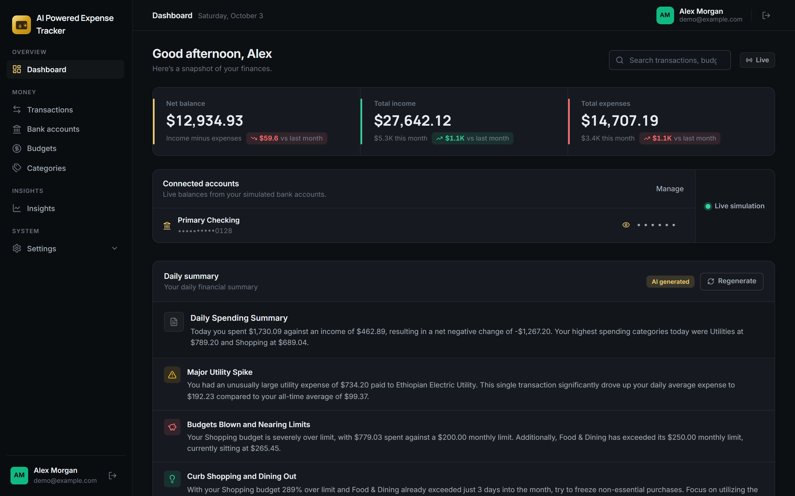
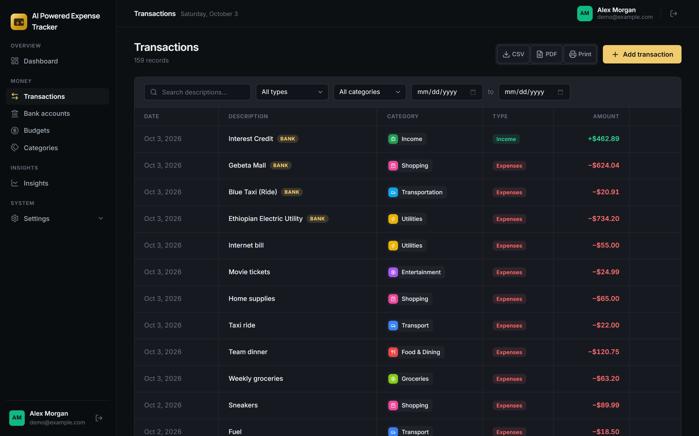
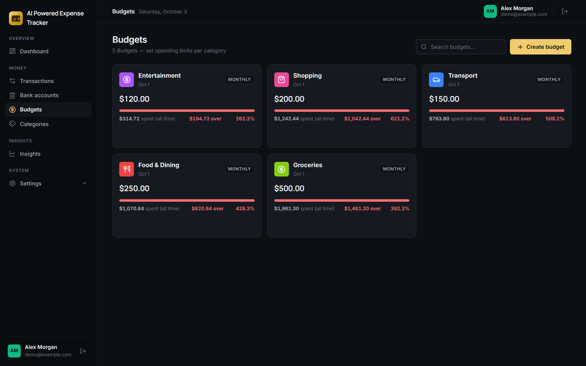
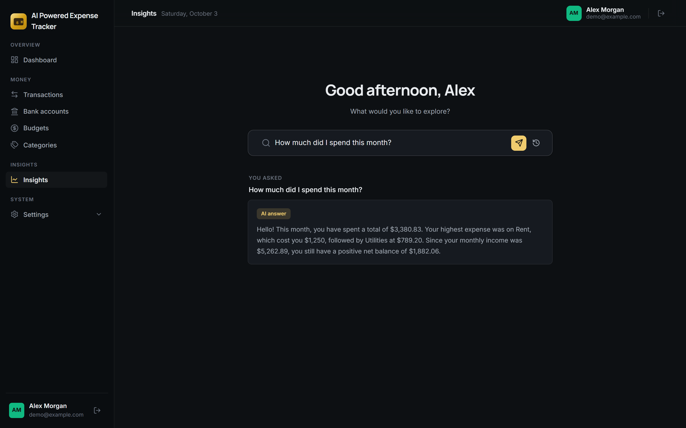
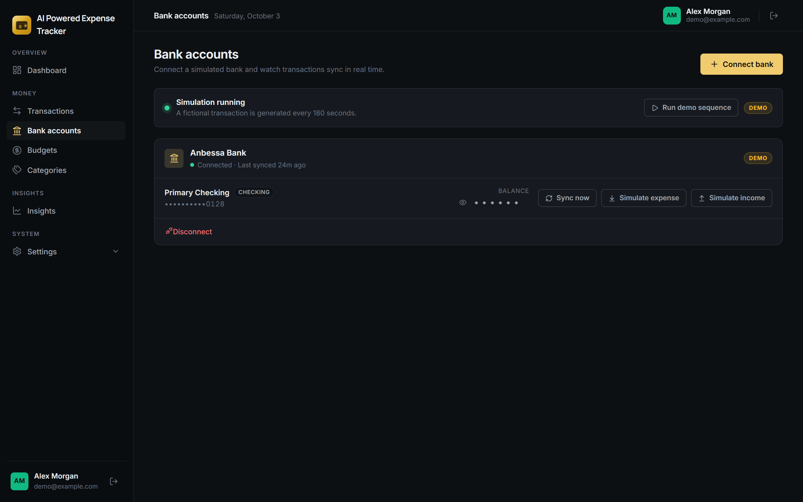
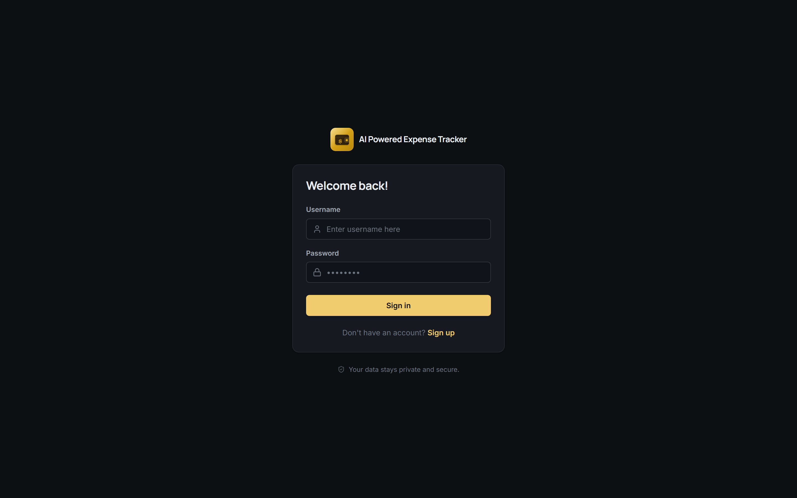

<div align="center">

# 💸 SpendWise

**An AI-powered expense tracker — track income, expenses, and budgets in real time.**

A full-stack application with a **Node.js + Express + PostgreSQL** REST API and a
**React + Vite** single-page frontend — JWT authentication, per-category budgets,
AI-generated daily insights, and a simulated bank connection with live updates.

[](https://nodejs.org)
[](https://expressjs.com)
[](https://www.postgresql.org)
[](https://react.dev)
[](https://vite.dev)
[](https://ai.google.dev)
[](LICENSE)

</div>

---

## 📸 Screenshots

| Dashboard                                                                 | Transactions                                                                 |
| :-----------------------------------------------------------------------: | :--------------------------------------------------------------------------: |
|  |  |
| **Budgets — live progress & spend alerts**                                | **AI Insights — ask questions about your data**                              |
|           |         |
| **Bank accounts — simulated bank, realtime sync**                         | **Sign in**                                                                  |
|      |                                     |

## ✨ Features

**Core money management**

- 💵 **Transactions** — full CRUD with type, category, and date-range filters, plus **CSV & PDF export**
- 🗂 **Categories** — customizable names, icons, and colors
- 🎯 **Budgets** — per-category limits with daily / weekly / monthly / yearly periods and live progress
- 📊 **Dashboard** — net balance, monthly income-vs-expense trend, and spending-by-category charts

**Intelligence & automation**

- 🤖 **AI Insights** — a personalized daily summary and a conversational Q&A over your own data (Google Gemini), with a deterministic **rule-based fallback** when no API key is configured
- 🏦 **Bank connections (simulated)** — link a fictional bank account with OTP verification and watch transactions, balances, budgets, and insights update **in real time** via Server-Sent Events. Simulation only — never a real bank, credentials, or money
- 🔔 **Budget alerts** — warnings the moment a synced expense pushes a budget past its threshold

**Experience & security**

- 🌍 **Multi-currency** — USD, EUR, GBP, ETB, KES, NGN, ZAR, INR, JPY, CAD, AUD
- 🌐 **English & Amharic** UI, with dark / light mode
- 🔒 **Privacy mode** — hide amounts with one click
- 🛡 **Hardened by default** — bcrypt password hashing, JWT with session revocation, rate limiting, strict CORS, and per-user data isolation on every route

## 🧰 Tech stack

| Layer     | Technology                                                                 |
| --------- | -------------------------------------------------------------------------- |
| Backend   | Node.js, Express, PostgreSQL (`pg`), morgan, dotenv                        |
| Auth      | JWT (`jsonwebtoken`), bcrypt, `express-rate-limit`                         |
| AI        | Google Gemini API (optional — built-in rule-based fallback)                |
| Realtime  | Server-Sent Events (no WebSocket dependency)                               |
| Frontend  | React 19, Vite, React Router, Recharts, lucide-react, jsPDF                |
| Testing   | Node.js built-in test runner, supertest, Postman collection                |
| Tooling   | Nodemon (auto-reload), oxlint, Vite build                                  |

## 📁 Project structure

```
expense-tracker/
├── backend/                  → Node.js + Express + PostgreSQL REST API
│   ├── server.js             → entry point (starts the HTTP server)
│   ├── setup.js              → creates the database schema (one-time)
│   ├── migrate.js            → applies a single SQL migration
│   ├── .env.example          → template for local configuration
│   ├── expense-tracker.postman_collection.json → ready-made Postman collection
│   └── src/
│       ├── config/           → DB connection pool & environment config
│       ├── controllers/      → business logic per resource
│       ├── middleware/       → JWT authentication
│       ├── migrations/       → SQL schema + incremental migrations
│       ├── routes/           → API route definitions
│       ├── services/         → AI insights pipeline (retrieve → generate → cache)
│       └── services/bank/    → Demo Bank simulation (provider, ledger, sync, simulator)
├── docs/
│   └── demo-bank.md          → Demo Bank architecture, API, and demo guide
└── frontend/                 → React + Vite single-page app
    └── src/
        ├── pages/            → Dashboard, Transactions, Budgets, Insights, …
        ├── components/       → reusable UI components
        ├── context/          → app state (UI, auth)
        └── hooks/            → shared hooks
```

## 🚀 Getting started

### Prerequisites

| Requirement  | Version                              |
| ------------ | ------------------------------------ |
| Node.js      | 18+ (20 LTS recommended)             |
| PostgreSQL   | 13+                                  |
| npm          | ships with Node.js                   |

### Installation

```bash
# 1. Clone the repository
git clone https://github.com/<your-username>/expense-tracker.git
cd expense-tracker

# 2. Backend — install, configure, create schema, run
cd backend
npm install
cp .env.example .env        # then edit the values (see table below)
npm run db:setup            # one-time: creates all database tables
npm run dev                 # API ready at http://localhost:3000

# 3. Frontend — in a second terminal
cd ../frontend
npm install
npm run dev                 # app opens at http://localhost:5173
```

> The Vite dev server proxies `/api` requests to the backend at `http://localhost:3000`,
> so **both servers must be running**.

### Environment variables

All backend configuration lives in `backend/.env` (copy from `.env.example`):

| Variable                | Required | Description                                                        |
| ----------------------- | -------- | ------------------------------------------------------------------ |
| `PORT`                  | ✅       | API port (default `3000`)                                          |
| `DATABASE_URL`          | ✅       | PostgreSQL connection string                                       |
| `JWT_SECRET`            | ✅       | Secret used to sign auth tokens — use a strong random value        |
| `NODE_ENV`              | ✅       | `development` or `production`                                      |
| `FRONTEND_URL`          | ✅       | Allowed CORS origin (default `http://localhost:5173`)              |
| `GEMINI_API_KEY`        | ❌       | Free key from [aistudio.google.com/apikey](https://aistudio.google.com/apikey) — unlocks AI insights |
| `AI_MODEL`              | ❌       | Gemini model to use (default `gemini-3.5-flash`)                   |
| `DEMO_BANK_*`           | ❌       | Demo Bank feature flags — see [docs/demo-bank.md](docs/demo-bank.md) |

> **No Gemini key?** Everything still works — the AI Insights feature automatically
> falls back to deterministic rule-based summaries.

## 🧪 Running tests

```bash
cd backend
npm test
```

The suite runs on Node's built-in test runner and needs **no database**: auth rate
limiting, transaction validation, budget alert logic, insights generation, Demo
Bank account/OTP/sync logic, and route auth gating.

## 📡 API overview

Base URL: `http://localhost:3000/api` — all protected routes expect
`Authorization: Bearer <token>`.

| Resource          | Key endpoints                                                        |
| ----------------- | -------------------------------------------------------------------- |
| **Auth**          | `POST /auth/register`, `POST /auth/login`, `GET/PUT /auth/profile`, `PUT /auth/password`, `DELETE /auth/account` |
| **Categories**    | `POST/GET /categories`, `PUT/DELETE /categories/:id`                 |
| **Transactions**  | `POST/GET /transactions` (filters: type, category, date range), `PUT/DELETE /transactions/:id` |
| **Budgets**       | `POST/GET /budgets` (with live spent totals), `PUT/DELETE /budgets/:id` |
| **Dashboard**     | `GET /dashboard/summary`, `GET /dashboard/monthly-trend`, `GET /dashboard/category-breakdown` |
| **AI Insights**   | `GET /insights`, `POST /insights/ask`                                |
| **Demo Bank**     | `POST /bank/connections` (+ verify OTP), `POST /bank/accounts/:id/sync`, `GET /bank/events` (SSE) |

📖 **Full API reference** — request/response examples for every endpoint, curl
commands, and the Postman workflow: **[backend/README.md](backend/README.md)**.

A ready-made Postman collection ships at
`backend/expense-tracker.postman_collection.json` — import it, run the requests
in order, and tokens/ids are saved automatically by the collection's test scripts.

## 📚 Documentation

| Document                                      | Contents                                                        |
| --------------------------------------------- | --------------------------------------------------------------- |
| [backend/README.md](backend/README.md)        | Full API reference, database setup & migrations, troubleshooting |
| [docs/demo-bank.md](docs/demo-bank.md)        | Demo Bank simulation — architecture, provider interface, demo script |
| [frontend/](frontend/)                        | React + Vite single-page application                            |

## 🔒 Security

- Passwords hashed with **bcrypt** (10 rounds)
- **JWT** tokens (7-day expiry) with `token_version`-based session revocation
- **Rate limiting** — 20 req/15 min on auth and bank-connect flows, 40 req/hour on AI insights
- **CORS** restricted to `FRONTEND_URL`
- Every query is scoped to the authenticated user — **a user can never read or modify another user's data**
- Simulated OTPs are stored **hashed**, expire in 5 minutes, and are limited to 5 attempts

## 🧩 Extending the bank integration

The Demo Bank is isolated behind a **provider interface**
(`backend/src/services/bank/bankProvider.js`). To integrate a real provider such
as Plaid later, implement the same interface and register it — the sync pipeline,
categorization, budgets, insights, realtime events, and frontend all stay
unchanged. See [docs/demo-bank.md](docs/demo-bank.md) §11.

## 🤝 Contributing

Contributions are welcome! If you'd like to improve SpendWise:

1. Fork the repository
2. Create your feature branch (`git checkout -b feature/amazing-feature`)
3. Commit your changes (`git commit -m "Add some amazing feature"`)
4. Push to the branch (`git push origin feature/amazing-feature`)
5. Open a Pull Request

## 📄 License

Distributed under the MIT License. See [`LICENSE`](LICENSE) for more information.

---

<div align="center">

**Built with Node.js, Express, PostgreSQL, and React** · Made with ❤️ and a lot of coffee

</div>
